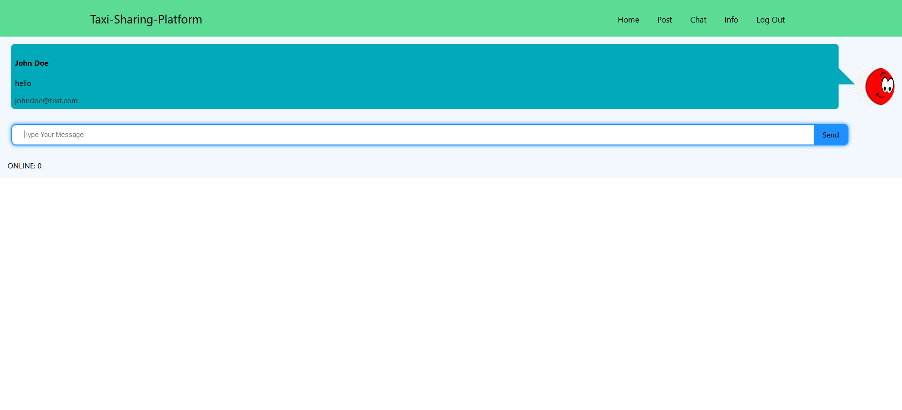

# Taxi-Sharing-Platform

Common online platform for IITK community where students can find other student of similar travel destination and can share taxi/cab. It has features like Authentication via Gmail, Posting a Query, Commenting on Post, Public and Private Chatting rooms, Auto deletion of Post within 3 days and Notification of Comments through Email.<br>
The Project is live at <a href="https://projects.akshayrathi.com/taxi-sharing-platform" target="_blank">link</a>

## Project Screen Shot(s)




## Installation and Setup Instructions

Clone down this repository. You will need `node` and `npm` installed globally on your machine.<br>
This repo contains two sub-folder UI and Server.

### Frontend:

Installation:

```
npm install
```

To Start Server:

```
npm start
```

To Visit App UI:

```
localhost:3000
```

### Backend:

Installation:

```
npm install
```

Now Place final build of UI inside Server folder (remember to add your configs of firestore before building)

To Start Server:

```
npm start
```

To Visit App:

```
localhost:3000
```

## Built With

The project has been build using below frameworks and tools:

- [React](https://reactjs.org/)
- [Redux](https://redux.js.org/)
- [SocketIo](https://socket.io/)
- [Express](https://expressjs.com/)
- [Firebase](https://firebase.google.com/)
- [NodeMailer](https://nodemailer.com/about/)

## Authors

Designed and Developed By [Akshay Rathi](https://akshayrathi.com)

<p><a href="https://akshayrathi.com/" target="_blank"></a>&nbsp;&nbsp;&nbsp;&nbsp;<a href="https://projects.akshayrathi.com/" target="_blank"></a>&nbsp;&nbsp;&nbsp;&nbsp;<a href="https://www.linkedin.com/in/akshay-rathi-sde/" target="_blank"></a>&nbsp;&nbsp;&nbsp;&nbsp;
</p><br/>
